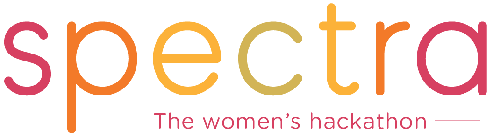

# Spectra Hackathon

### Exploring the Tech Space Together

Spectra is an organization that hosts bi-annual, full-day events on the west coast for women in tech. Mostly recently, we hosted a women’s hackathon at YouTube HQ in July 2016.

We are passionate about bringing together female students and professionals in tech from all around the world. Our events offer attendees a safe and inviting environment to experiment with technology at any experience level.

We believe that every woman should have the opportunity to excel in computer science and strengthen her technical abilities. The Spectra team invites you to come learn new skills, inspire one another, and build long-lasting connections at Spectra.

## Steps to Success

* Get a [Cloudinary](https://cloudinary.com/signup) Account and Credentials
* Join our [Slack Channel](https://join.slack.com/t/cloudinarydevelopers/shared_invite/enQtMzcyODQ3NTMxMzAxLWIwNzlmZTQxMjNhYmZhOGNmNWY3NjExMGU1M2RmODAzOWIzMTY4YjhkOWQ2YzE0ZGIwNWM2NDk1ZTE5ZTdhOWU) - [http://bit.ly/cloudinary-developers-slack](http://bit.ly/cloudinary-developers-slack)​

This event brings together coders, developers, hackers, artists, designers and tech specialists for 24 hours of intense work, debates, brainstorming, innovation, camaraderie and fun! Each team is invited to formulate solutions to problems and create new pathways to move the music industry forward

We're hackers too, so we know your time at the Hackathon is limited. That's why we've developed this guide to help you harness our technology to realize your ideas in the most efficient way possible.  



This Hackathon Guide is a living document which we update frequently with additional info and code examples. It's meant to be a quick start in learning about Cloudinary and how to integrate other APIs featured at this event. Don't forget to check back here often for new content.


