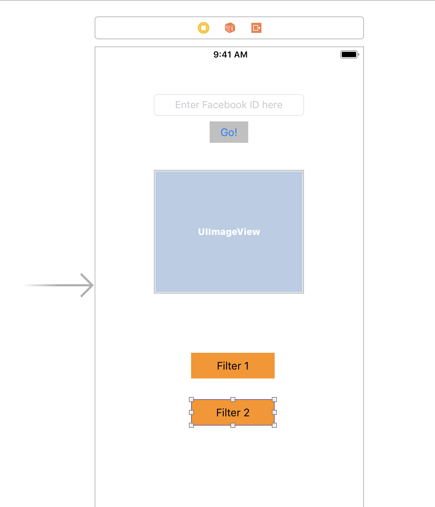
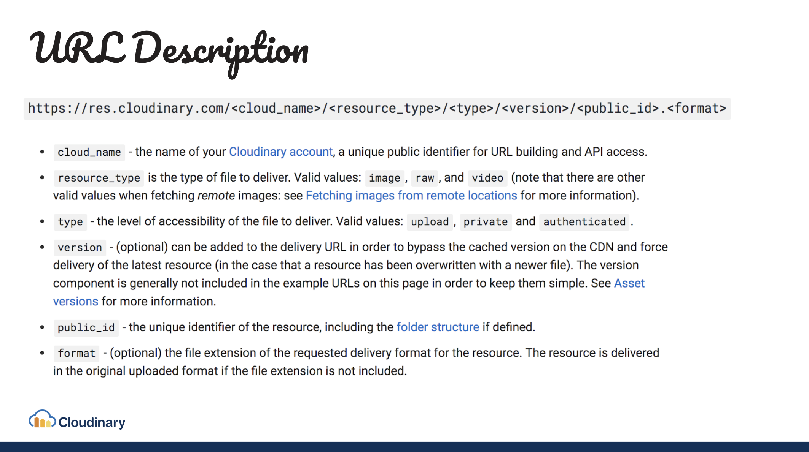

# Intro to iOS Workshop + Photo Filter App Tutorial

This tutorial covers a basic introduction to iOS Development using Swift, followed by an interactive tutorial using Cloudinary functionality.

## Intro to iOS Presentation

See presentation slides here: \[link\]

## Tutorial: Build a Fun Photo Filter App!

In this tutorial we'll build an iOS application that adds a customized filter to a user's Facebook profile image.

### Pre-requisites & Installations:

* Macbook
* Latest stable version of Xcode
* [CocoaPods](https://cocoapods.org/)
* Clone Starter project here: [https://github.com/timirahj/spectra-hackathon](https://github.com/timirahj/spectra-hackathon)
* [Cloudinary Account](https://www.cloudinary.com)

## Viewing a User's Profile Image

To integrate a profile picture in your app, you simply point to a URL that contains the user's application-specific numeric **Facebook ID**. You can also specify the numeric ID of a public Facebook page.

For example, if your Cloudinary cloud name is ‘demo’, the following URL will display the profile picture of Bill Clinton:

```
https://res.cloudinary.com/demo/image/facebook/65646572251.jpg
```



When a user accesses such a URL for the first time, Cloudinary downloads the appropriate profile picture from Facebook, stores it locally in a high performance storage solution, and distributes it through a CDN. The next users to access it will receive the image quickly through the CDN while using smart cache settings.

**Note:** For privacy protection reasons, Facebook no longer supports accessing user images based on the user name; only the application-specific numeric ID.


**You can find a user's Facebook ID number here:** [**https://findmyfbid.com/**](https://findmyfbid.com/)\*\*\*\*

> Spectra Filter

#### Color Change


## Building the App



## Loading the Image



```text
 @IBAction func enterTapped(_ sender: Any) {
        
      fbImageUrl = "https://res.cloudinary.com/demo/image/facebook/" + textField.text! + ".jpg"
        
      //replace 'demo' folder with the name of your cloud
      userImage.load.request(with: fbImageUrl)
        
      print(fbImageUrl)
    }
```

## Filter Functions

#### Spectra Filter  +  Color Change

```
 @IBAction func spectraFilter(_ sender: Any) {
        
        fbImageUrl = "https://res.cloudinary.com/demo/image/facebook/l_spectra:spectra-logo,e_make_transparent,w_0.7,o_70/" + textField.text! + ".jpg"
        userImage.load.request(with: fbImageUrl)        
    }
    
```


```text
  @IBAction func changeColor(_ sender: Any) {
        
        fbImageUrl = "https://res.cloudinary.com/timirahj/image/facebook/ar_2:3,c_fill/e_replace_color:green:55:red/" + textField.text! + ".jpg"
        userImage.load.request(with: fbImageUrl)        
    }
```


## Refreshing Facebook Pictures

Cloudinary automatically checks whether whether Facebook pictures have changed, according to a pre-defined caching period. If so, Cloudinary automatically re-fetches the original image as well as all transformed images. By default, Facebook images are checked for changes once every 7 days.

You can also force an \`explicit\` refresh of a Facebook picture. When you use this option, the call returns the version of the new image, which you can use to bypass previously cached CDN copies. Alternatively, you can use the \`invalidate\` parameter, but if you do, make sure you are aware of the considerations involved in [invalidating cached media assets on the CDN](https://cloudinary.com/documentation/upload_images#invalidating_cached_media_assets_on_the_cdn).

